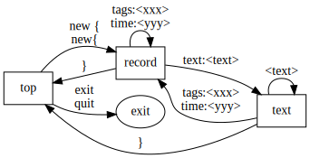

# Mediary
*Mediary* is a tool to write and store events into a machine-readable format.

## Installation
go get github.com/jsilvela/mediary<br/>
go build github.com/jsilvela/mediary

## Usage
	> mediary <optional file>

If no file is provided, mediary will create a new one, mediary.txt, in the
current directory.

Mediary reads from stdin and is line-oriented.

The syntax can be represented like so:



You start a new record by typing<br/>
```new {``` or ```new{```<br/>
and finish with ```}```

In the context of a record, you can specify the following fields:

* ```time: <my time>``` with the time either "today", or in the format
"2014-01-30"

* ```tags: <my tags>``` accepting a comma-separated list

* ```text: <my text>``` the program goes into text mode, which allows multi-line
text.

Outside of the context of an entry, each line is seen as a full and final
sentence, containing some filters, and a reporting directive.

* Filters: ```week```
* Reports: ```tags```, ```latest```

For example, a line could be: ```week latest```

To finish your session,<br/>
```exit``` or ```quit```

## Motivation
I've been keeping a notebook with health-related events, which has been pretty
useful. I want to transition it to files, but plain text means that any
reporting would be done with regex or similar. I'd like a good way to ask
questions, and I think a SQL db is too heavy-weight. Hence this project.

## Details
Concept version coded in *go* (this is my first Go program). Uses JSON for
storage.
Currently very much a CLI, but eventually would be nice to have this in a mobile
o.s.
